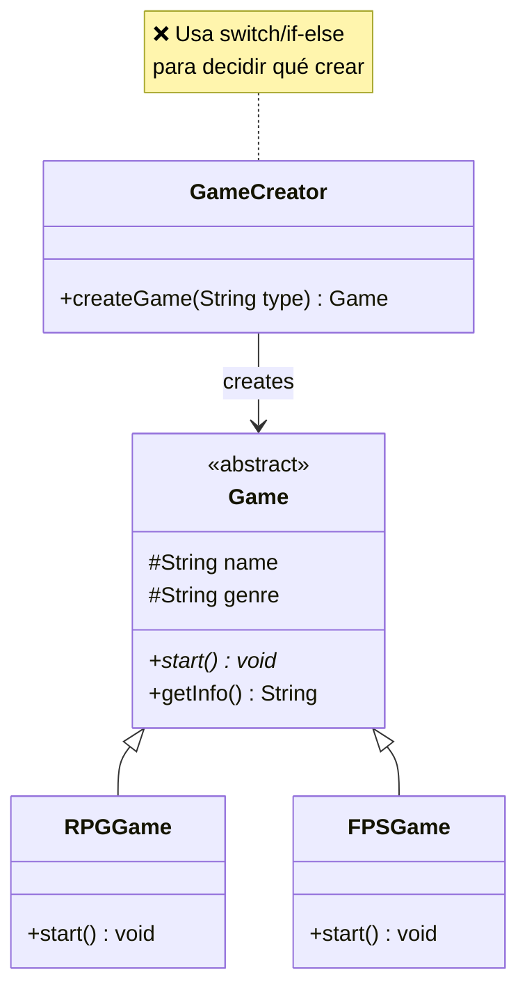
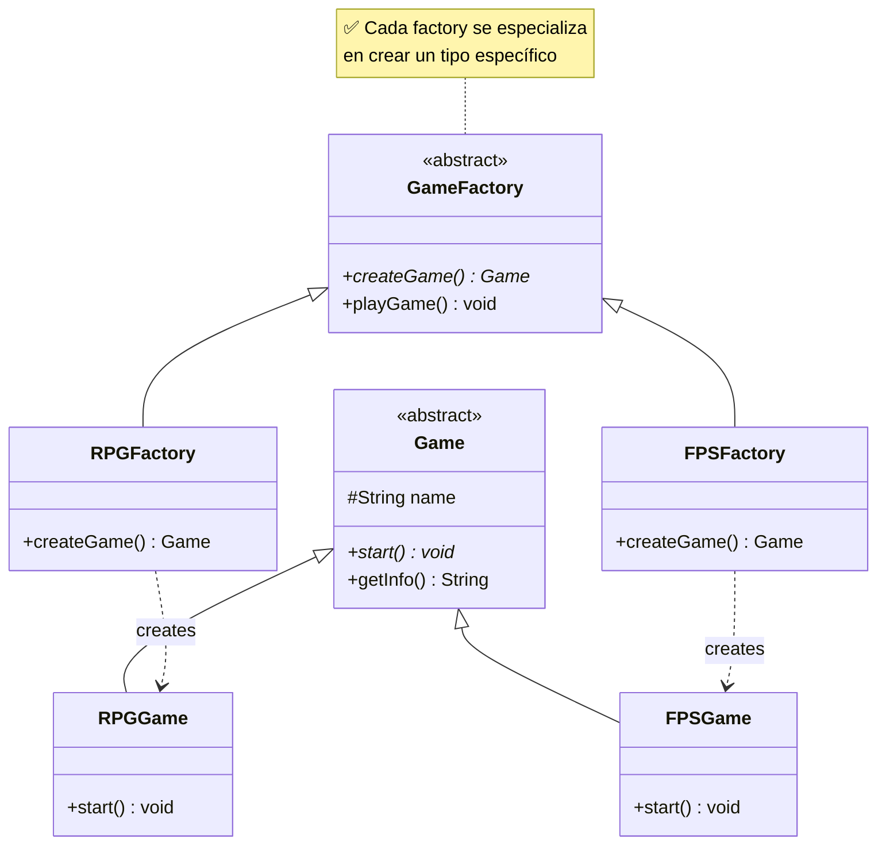
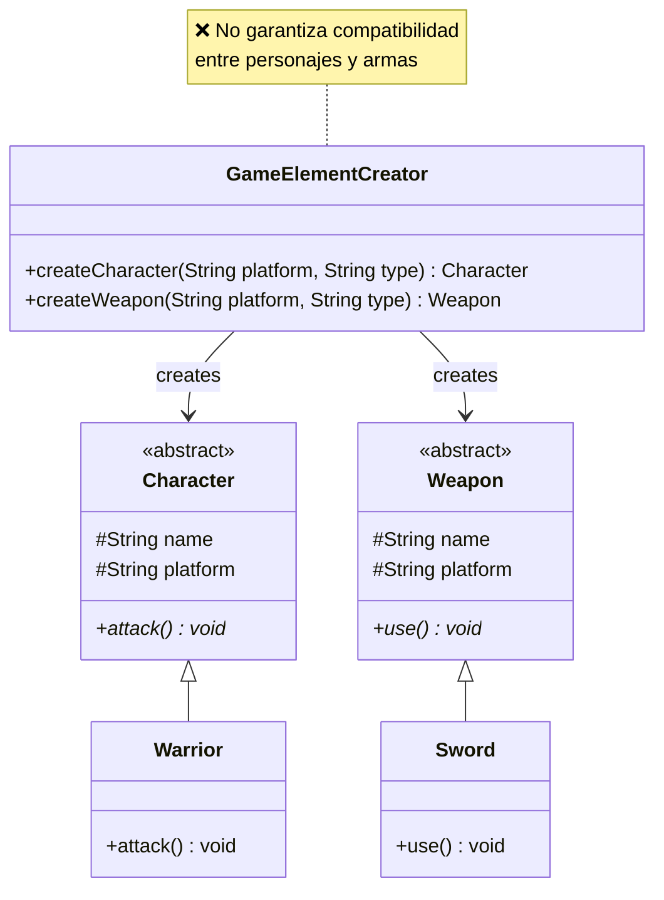
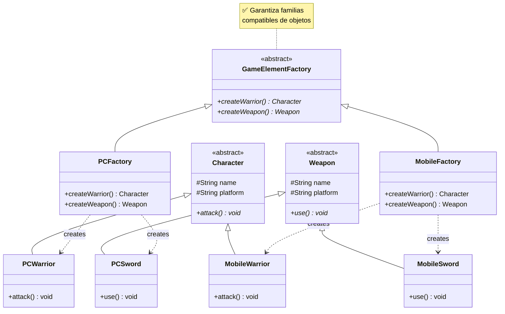
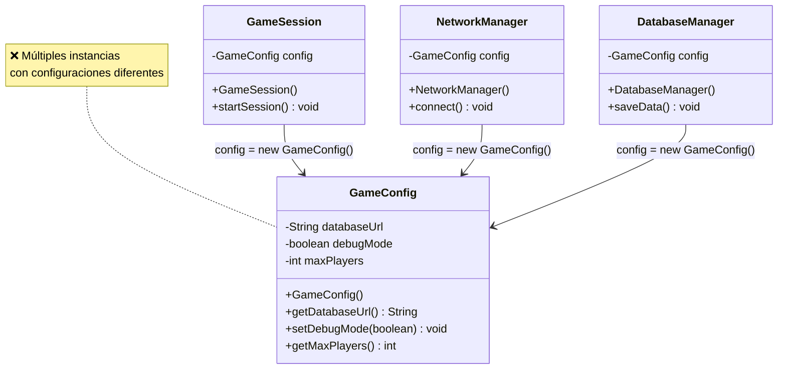
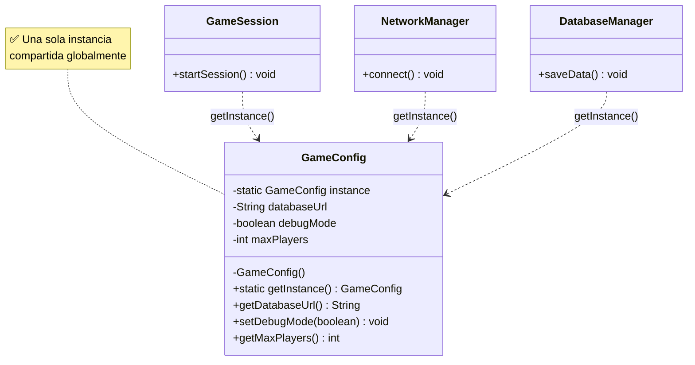

# Laboratorio 03: Patrones Creacionales (Versión Simplificada)

- **Curso**: Ingeniería de Software II
- **Aula**: 851
- **Fecha**: 03/10/2025
- **Jefe de prácticas**: Sebastián Chávarry

---

## Caso de Estudio: Sistema de Juegos Básico

Una empresa desarrolladora necesita un sistema simple para crear juegos y gestionar configuraciones. El sistema debe manejar diferentes tipos de juegos y mantener configuraciones únicas.

---

## Preparación del Proyecto

1. Crea 4 paquetes:
   - `ejercicio01` - Factory Method
   - `ejercicio02` - Abstract Factory
   - `ejercicio03` - Singleton

---

## Ejercicio 1: Factory Method Pattern

### 1) Diagrama del Código Actual (Problemático):

### 2) Diagrama de la Solución (Factory Method):

### 3) ¿Por qué está mal y cómo mejora Factory Method?

#### **Problemas del código actual:**

1. **Viola el Principio Abierto/Cerrado (OCP):**

   - Para agregar un nuevo tipo de juego (ej: PuzzleGame), hay que modificar `GameCreator`
   - El `if-else` crece con cada nuevo tipo

2. **Acoplamiento fuerte:**

   - `GameCreator` debe conocer todas las clases concretas de juegos
   - Cambios en los tipos de juegos afectan directamente al creador

3. **Responsabilidad múltiple:**
   - `GameCreator` tiene que saber cómo crear cada tipo específico
   - Mezcla lógica de decisión con lógica de creación

#### **Cómo mejora Factory Method:**

1. **Cumple OCP:**

   - Nuevos tipos = nuevas factories, sin modificar código existente
   - Extensión por herencia, no por modificación

2. **Reduce acoplamiento:**

   - Cada factory solo conoce su tipo específico de juego
   - El cliente solo interactúa con la abstracción `GameFactory`

3. **Responsabilidad única:**
   - Cada factory tiene una sola responsabilidad: crear su tipo específico
   - La lógica de creación está encapsulada en cada factory

#### **Implementa la solución creando:**

- `GameFactory` (abstracto) con `createGame()` abstracto y `playGame()` concreto
- `RPGFactory` y `FPSFactory` que extiendan `GameFactory`
- `PuzzleFactory` para demostrar extensibilidad

---

## Ejercicio 2: Abstract Factory Pattern

### 1) Diagrama del Código Actual (Problemático):

### 2) Diagrama de la Solución (Abstract Factory):

### 3) ¿Por qué está mal y cómo mejora Abstract Factory?

#### **Problemas del código actual:**

1. **No garantiza compatibilidad entre objetos:**

   - Puedes crear un `PCWarrior` con `MobileSword` accidentalmente
   - Los objetos dependen de parámetros `String` que pueden ser incorrectos

2. **Lógica condicional dispersa:**

   - Cada clase tiene `if-else` para manejar diferentes plataformas
   - El mismo código condicional se repite en múltiples lugares

3. **Difícil de mantener:**
   - Cambiar el comportamiento de una plataforma requiere modificar múltiples clases
   - Agregar una plataforma nueva implica tocar todas las clases existentes

#### **Cómo mejora Abstract Factory:**

1. **Garantiza compatibilidad:**

   - `PCFactory` solo crea objetos PC que son compatibles entre sí
   - `MobileFactory` solo crea objetos Mobile compatibles
   - Imposible mezclar objetos de diferentes familias

2. **Elimina lógica condicional:**

   - Cada clase se especializa en una plataforma específica
   - No hay `if-else` para determinar comportamiento

3. **Facilita mantenimiento:**
   - Nueva plataforma = nueva factory + nuevas clases específicas
   - Cambios en una plataforma no afectan a otras

#### **Implementa la solución creando:**

- `GameElementFactory` (interface) con métodos de creación
- `PCFactory` y `MobileFactory` que implementen la interface
- Clases específicas: `PCWarrior`, `MobileWarrior`, `PCSword`, `MobileSword`
- Cliente que use una factory sin conocer implementaciones específicas

---

## Ejercicio 3: Singleton Pattern

### 1) Diagrama del Código Actual (Problemático):

### 2) Diagrama de la Solución (Singleton):

### 3) ¿Por qué está mal y cómo mejora Singleton?

#### **Problemas del código actual:**

1. **Configuraciones inconsistentes:**

   - Cada componente crea su propia instancia de `GameConfig`
   - Las configuraciones pueden ser diferentes entre componentes
   - Los cambios en una instancia no se reflejan en otras

2. **Desperdicio de recursos:**

   - Múltiples objetos en memoria con la misma información
   - Cada instancia consume memoria innecesariamente

3. **Dificultad de sincronización:**

   - No hay forma de mantener configuraciones sincronizadas
   - Los cambios globales requieren actualizar múltiples objetos

4. **Pérdida de configuraciones:**
   - Si un componente modifica su configuración, otros no se enteran
   - No hay "fuente única de verdad" para las configuraciones

#### **Cómo mejora Singleton:**

1. **Configuración consistente:**

   - Una sola instancia garantiza que todos vean la misma configuración
   - Los cambios son inmediatamente visibles para todos los componentes

2. **Ahorro de recursos:**

   - Una sola instancia en memoria, independientemente de cuántos la usen
   - Gestión eficiente de configuraciones globales

3. **Punto de control centralizado:**
   - Todas las configuraciones se manejan desde un solo lugar
   - Fácil de debuggear y mantener

#### **Implementa la solución creando:**

- `GameConfig` singleton thread-safe con `getInstance()`
- `NetworkConfig` singleton usando enum
- Modificar los clientes para usar `getInstance()` en lugar de `new`

---

_Enfócate en entender por qué el código inicial es problemático antes de implementar la solución._
